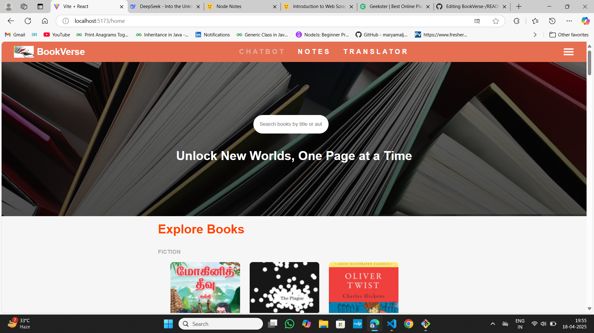
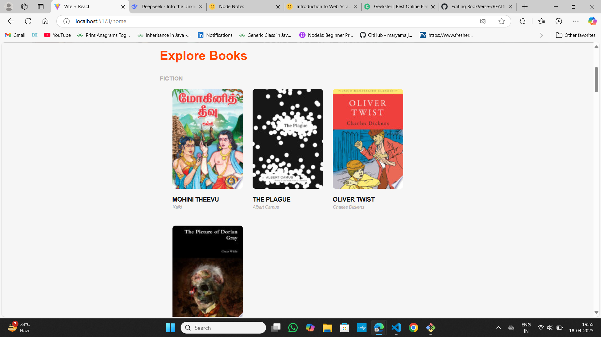
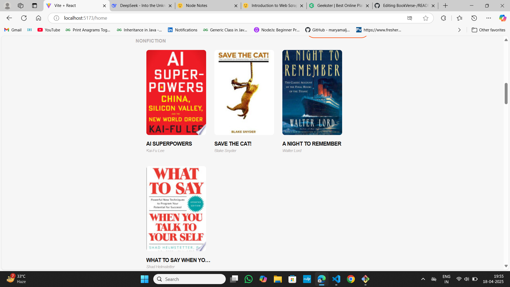
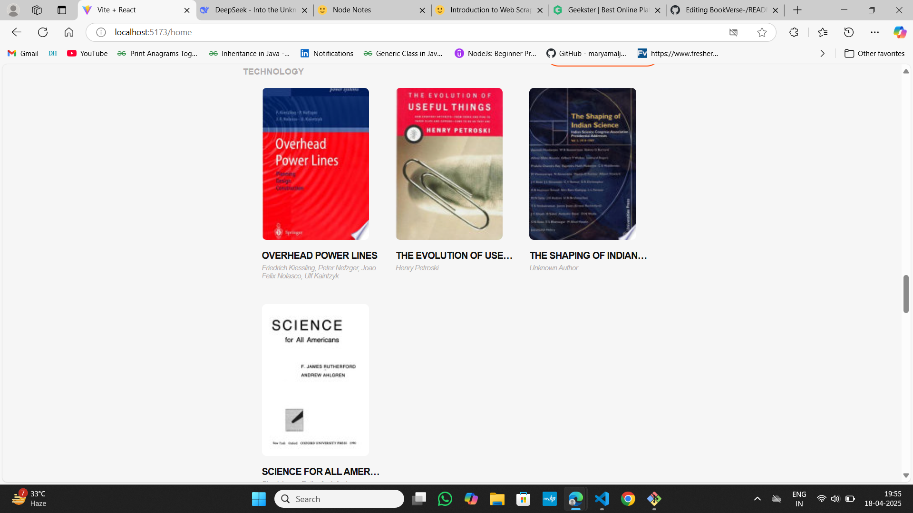
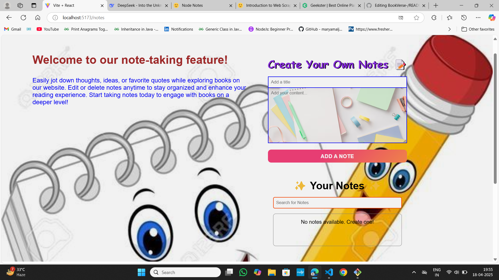
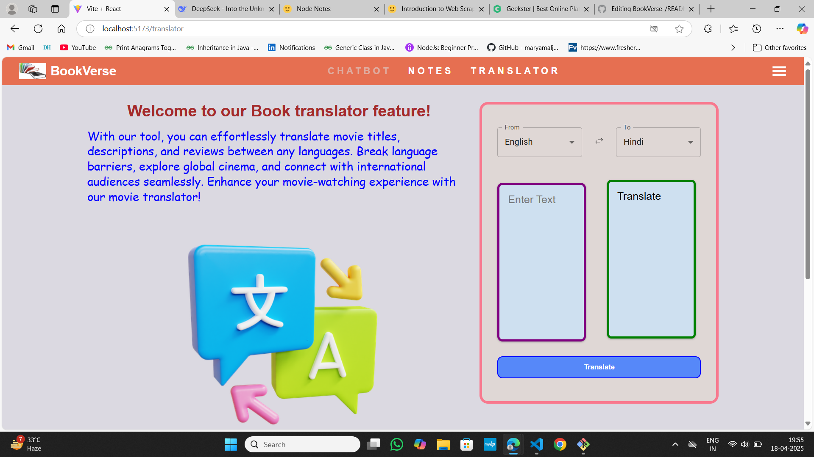
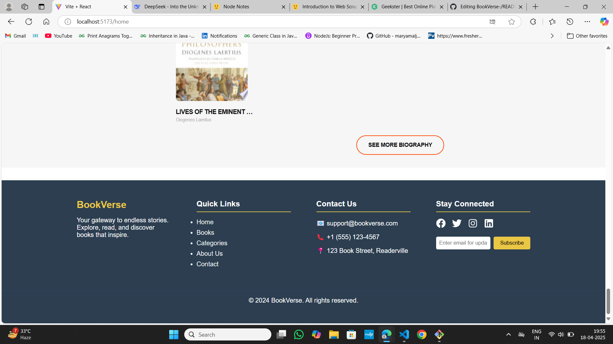

# BookVerse App 📚

[](https://reactjs.org/)
[](https://redux.js.org/)
[](https://firebase.google.com/)
[](https://opensource.org/licenses/MIT)

A modern web application for discovering and managing books using Google Books API with Firebase integration.

## App Screenshots 📸






### Notes Page


### Translator Page


### Footer



## Features ✨

- **🔍 Advanced Book Search**  
  Instant search with Google Books API integration
- **🔥 Firebase Authentication**  
  Secure user login/signup with email/password
- **❤️ Favorites System**  
  Save favorite books to Firebase Firestore
- **🔄 Real-time Updates**  
  Instant synchronization using Firebase listeners
- **📱 Responsive Design**  
  Mobile-first approach with responsive layouts
- **🌓 Dark Mode Support**  
  Toggle between dark/light themes

## Technologies Used 💻

- **Frontend**: React, React Router
- **State Management**: Redux Toolkit
- **Authentication**: Firebase Authentication
- **Database**: Cloud Firestore
- **API**: Google Books API
- **Styling**: CSS Modules/CSS-in-JS
- **Build Tool**: Vite/CRA

## Installation ⚙️

1. Clone the repository
   ```bash
   git clone https://github.com/your-username/book-app.git
   cd book-app
